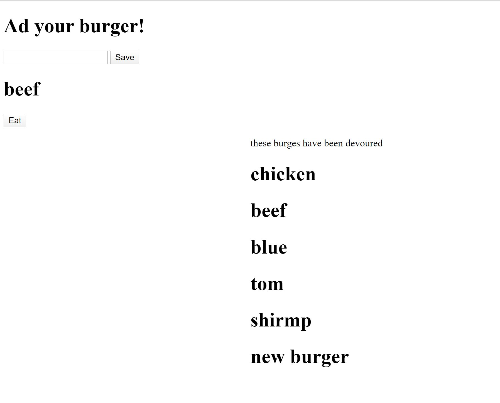
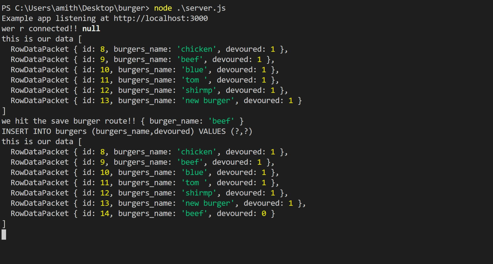

# Burger App, CLI program to handle MySQL database

Here i've created a burger logger with MySQL, Node, Express, Handlebars and a homemade ORM (yum!). i've followed the MVC design pattern; use Node and MySQL to query and route data in my app, and Handlebars to generate my HTML.


* Eat-Da-Burger! is a restaurant app that lets users input the names of burgers they'd like to eat.

* Whenever a user submits a burger's name, your app will display the burger on the left side of the page -- waiting to be devoured.

* Each burger in the waiting area also has a `Devour it!` button. When the user clicks it, the burger will move to the right side of the page.

* Your app will store every burger in a database, whether devoured or not.


## video presentation 
    N/A

## Instructions

#### App Setup

1. Create a GitHub repo called `burger` and clone it to your computer.

2. Make a package.json file by running `npm init` from the command line.

3. Install the Express npm package: `npm install express`.

4. Create a server.js file.

5. Install the Handlebars npm package: `npm install express-handlebars`.

6. Install MySQL npm package: `npm install mysql`.

7. Require the following npm packages inside of the server.js file:
   * express

#### DB Setup

1. Inside your `burger` directory, create a folder named `db`.

2. In the `db` folder, create a file named `schema.sql`. Write SQL queries this file that do the following:

   * Create the `burgers_db`.
   * Switch to or use the `burgers_db`.
   * Create a `burgers` table with these fields:
     * **id**: an auto incrementing int that serves as the primary key.
     * **burger_name**: a string.
     * **devoured**: a boolean.

3. Still in the `db` folder, create a `seeds.sql` file. In this file, write insert queries to populate the `burgers` table with at least three entries.

4. Run the `schema.sql` and `seeds.sql` files into the mysql server from the command line

5. Now you're going to run these SQL files.

   * Make sure you're in the `db` folder of your app.

   * Start MySQL command line tool and login: `mysql -u root -p`.

   * With the `mysql>` command line tool running, enter the command `source schema.sql`. This will run your schema file and all of the queries in it -- in other words, you'll be creating your database.

   * Now insert the entries you defined in `seeds.sql` by running the file: `source seeds.sql`.

   * Close out of the MySQL command line tool: `exit`.

#### Config Setup

1. Inside your `burger` directory, create a folder named `config`.

2. Create a `connection.js` file inside `config` directory.

   * Inside the `connection.js` file, setup the code to connect Node to MySQL.

   * Export the connection.

3. Create an `orm.js` file inside `config` directory.

   * Import (require) `connection.js` into `orm.js`

   * In the `orm.js` file, create the methods that will execute the necessary MySQL commands in the controllers. These are the methods you will need to use in order to retrieve and store data in your database.

     * `selectAll()`
     * `insertOne()`
     * `updateOne()`

   * Export the ORM object in `module.exports`.

#### Model setup

* Inside your `burger` directory, create a folder named `models`.

  * In `models`, make a `burger.js` file.

    * Inside `burger.js`, import `orm.js` into `burger.js`

    * Also inside `burger.js`, create the code that will call the ORM functions using burger specific input for the ORM.

    * Export at the end of the `burger.js` file.

#### Controller setup

1. Inside your `burger` directory, create a folder named `controllers`.

2. In `controllers`, create the `burgers_controller.js` file.

3. Inside the `burgers_controller.js` file, import the following:

   * Express
   * `burger.js`

4. Create the `router` for the app, and export the `router` at the end of your file.

#### View setup

1. Inside your `burger` directory, create a folder named `views`.

   * Create the `index.handlebars` file inside `views` directory.

   * Create the `layouts` directory inside `views` directory.

     * Create the `main.handlebars` file inside `layouts` directory.

     * Setup the `main.handlebars` file so it's able to be used by Handlebars.

     * Setup the `index.handlebars` to have the template that Handlebars can render onto.

     * Create a button in `index.handlebars` that will submit the user input into the database.

#### Directory structure

All the recommended files and directories from the steps above should look like the following structure:

```
.
├── config
│   ├── connection.js
│   └── orm.js
│ 
├── controllers
│   └── burgers_controller.js
│
├── db
│   ├── schema.sql
│   └── seeds.sql
│
├── models
│   └── burger.js
│ 
├── node_modules
│ 
├── package.json
│
├── public
│   └── assets
│       ├── css
│       │   └── burger_style.css
│       └── img
│           └── burger.png
│   
│
├── server.js
│
└── views
    ├── index.handlebars
    └── layouts
        └── main.handlebars
```


## Build status
project still in development phase

    Build status of continus integratio
    tools: (to be used):
        1. jenkins
        2. heroku
    
[](https://travis-ci.org/akashnimare/foco)
[](https://ci.appveyor.com/project/akashnimare/foco/branch/master)

## Code style

[](https://github.com/feross/standard)


## Tech/framework used
    node.js

## Features

    1. user friendly
    2. simplified 
    3. Easy Navigation
    4. SEO (Search Engine Optimization)
    5. Mobile Friendly

## Code Example

    1. Used consistent indentation
    2. Followed the DRY Principle
    3. Avoided Deep Nesting
    4. kept Limited line length
    5. standard File and folder structure
    6. standard Naming conventions.
    7. Kept the code simple.

## Installation

    To run the template engine: node app.js

## Screenshot
Terminal Screenshot




## API Reference

    https://www.npmjs.com/package/inquirer
    https://www.npmjs.com/package/console.table 

## Tests
    N/A

## Contribute

Let people know how they can contribute into your project. A [contributing guideline](https://github.com/zulip/zulip-electron/blob/master/CONTRIBUTING.md) will be a big plus.

## Credits
upenn coding bootcamp


## License
A short snippet describing the license (MIT, Apache etc)

MIT © [Amith Das]()